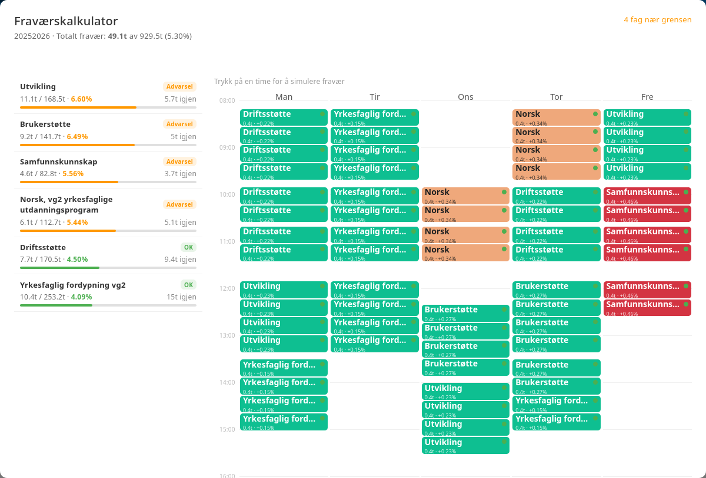

# 🏫 inskewl

> **QOL (Quality-of-Life) userscript for VIS InSchool**  
> Fordi VIS InSchool er greit, men kunne vært *så* mye bedre. Utviklet i det herrens år 2026 🙏

[](https://github.com/MathiasDevelopes/inskewl/releases)
[](https://github.com/MathiasDevelopes/inskewl/blob/main/LICENSE)
[](https://www.typescriptlang.org/)

---

## 📌 Innholdsfortegnelse
- [Om prosjektet](#-om-prosjektet)
- [Funksjoner](#-funksjoner)
- [Installasjon](#%EF%B8%8F-installasjon)
- [For utviklere (skumle greier)](#%EF%B8%8F-for-utviklere-skumle-greier)

---

## 🔮 Om prosjektet

**inskewl** er et uoffisielt og lidenskapelig utviklet userscript som tetter hullene i VIS InSchool. 

Det hele startet fordi VIS InSchool kun lar deg eksportere timeplanen din som en flat PDF-fil (ja, i **2026**...). Nå gjør vi hverdagen litt smidigere, én modul om gangen.

---

## ✨ Funksjoner

### 📅 Kalendereksport (`.ics`)
* **Hva gjør den?** Eksporterer hele timeplanen din for halvåret til en universell `.ics`-kalenderfil.
* **Kompatibilitet:** Fungerer sømløst med Google Calendar, Apple Calendar, Microsoft Outlook/Exchange, og alt annet som liker standard formater.
* *Slipp å taste inn timene dine manuelt!*

### 🧮 Fraværskalkulator (takk til Kari Nessa Nordtun)



* **Hva gjør den?** Lar deg simulere fravær direkte i den interaktive timeplanen din.
* **Simulering:** Klikk på vilkårlige timer for å lynraskt bytte status mellom tilstede og simulert fravær.
* **Statistikk:** Beregner nøyaktig fraværsprosent og timer i sanntid.
* **Visualisering:** Viser 10%-grensen tydelig, slik at du vet nøyaktig hvor mye du har å gå på før alarmen går. 🚨

### ⏳ Planlagt
* *Neste ting jeg irriterer meg over...* (Kom gjerne med forslag i [Issues](https://github.com/MathiasDevelopes/inskewl/issues)!)

---

## ⚙️ Installasjon

### Forutsetninger
Du trenger en moderne nettleser og en utvidelse (userscript-manager) for å kjøre scriptet:
1. Installer en userscript-manager:
   * **[Violentmonkey](https://violentmonkey.github.io/)** (Anbefalt – rask og open-source!)
   * [Tampermonkey](https://www.tampermonkey.net/)
   * [Greasemonkey](https://www.greasespot.net/)

### Installasjonssteg
1. Trykk [her](https://github.com/MathiasDevelopes/inskewl/releases/latest/download/inskewl.user.js).
2. Trykk på **Installer**-knappen i fanen som automatisk dukker opp fra userscript-manageren din.
3. Gå til VIS InSchool (eller refresh siden om du allerede er der), så starter magien av seg selv! 🎉

---

## 🛠️ For utviklere (skumle greier)

Vil du bidra til prosjektet eller bygge din helt egen modul? Sjekk ut den fantastiske [wikien vår](https://github.com/MathiasDevelopes/inskewl/wiki)!

### Kjappe fakta om arkitekturen:
* **Uoffisielt API:** Bygget på et reverse-engineered, uoffisielt VIS InSchool API.
* **Moderne Stack:** Sterk typing med TypeScript og runtime schema-validering via Zod.
* **Modulært:** Hver funksjon er en frittstående modul (blueprint), som gjør det ekstremt enkelt å koble på nye ideer uten å rote til eksisterende kode.

---

### 🧪 Testing av API-schemas
Hvis du opplever problemer eller mistenker at VIS har oppdatert API-et sitt, kan du validere alle Zod-schemas direkte i nettleseren din:
1. Logg inn på VIS InSchool.
2. Åpne utviklerverktøyet i nettleseren (**F12** -> gå til **Console**-fanen).
3. Skriv inn følgende kommando og trykk enter:
   ```javascript
   testAllApiSchemas()
   ```
4. Konsollen vil nå kjøre tester mot alle API-endepunkter og gi deg en ryddig rapport med suksess/feil og nøyaktige Zod-valideringsavvik.

---

### 📦 Bygg fra kildekode

#### Krav
* [Node.js](https://nodejs.org/) & `npm`
* `git`

#### Kommandoer
For å klone, installere og bygge prosjektet lokalt:
```bash
# Klon repoet
git clone https://github.com/MathiasDevelopes/inskewl.git
cd inskewl

# Installer avhengigheter
npm install

# Bygg produksjonsversjon
npm run build
```
Den ferdige, komprimerte userscript-filen vil legge seg under `dist/inskewl.user.js`.

#### Utviklingsmodus (Hot-rebuild)
```bash
npm run dev
```
Dette starter en watcher som re-builder prosjektet lynraskt hver gang du lagrer en fil. Ganske digg! 😎
