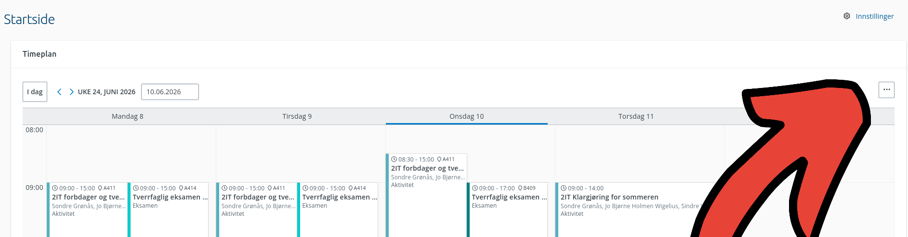
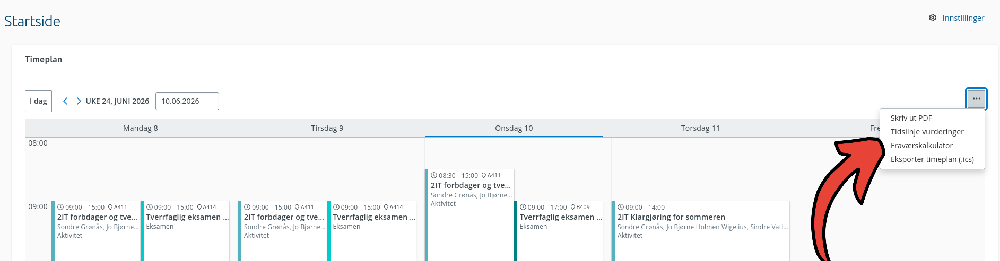

# 2. Fraværskalkulator

Fraværskalkulatoren viser hvordan fremtidig fravær kan påvirke fraværsprosenten din.

Den registrerer ikke fravær. Alt du klikker på er bare en simulering i nettleseren.

## Dette kan du gjøre

- Se fraværsprosenten din per fag.
- Se hvor mange timer du har igjen før du nærmer deg fraværsgrensen.
- Klikke på fremtidige timer for å simulere fravær.
- Bytte til kommende uker.
- Nullstille og prøve på nytt.

## Prøv først

Demoen under bruker eksempeldata. Den er ikke koblet til VIS InSchool.

Klikk på en time i ukevisningen og se hva som skjer med fraværsprosenten.

## Slik bruker du den i VIS

Gå til startsiden eller timeplanen i VIS InSchool.

Klikk på menyknappen med tre prikker oppe til høyre i timeplanen:

Velg **Fraværskalkulator** i menyen:

Fraværskalkulatoren åpnes i VIS. Bruk ukevelgeren for å se kommende uker.
Klikk på fremtidige timer for å simulere fravær i de timene. Klikk på en valgt
time en gang til for å fjerne den fra simuleringen.

Statusene viser om simuleringen fortsatt er under fraværsgrensen:

- **OK** betyr at simuleringen er under grensen.
- **Advarsel** betyr at du nærmer deg grensen.
- **Over grensen** betyr at simuleringen går over grensen.

## Eksempel

Hvis du har 7,5 prosent fravær i et fag og vurderer å være borte fra en
dobbelttime, kan du klikke på de to fremtidige timene. Kalkulatoren viser den
nye simulerte prosenten før du tar en avgjørelse.

## Hvis det ikke fungerer

Sjekk at userscriptet er aktivert, at du er logget inn i VIS InSchool, og at du
står på en side med timeplan. Last siden på nytt hvis kalkulatoren ikke vises.
Hvis timeplanen eller fraværsdata ikke lastes, kan VIS InSchool ha endret dataene
modulen bruker.

Se også [hjelp og feilsøking](../hjelp.md).

## Begrensninger

- Simuleringen registrerer ikke faktisk fravær.
- Tidligere timer kan ikke simuleres.
- Modulen bruker data fra VIS InSchool og kan slutte å fungere hvis VIS endrer systemet sitt.

**Neste:** [Eksporter timeplanen din](kalendereksport.md)
