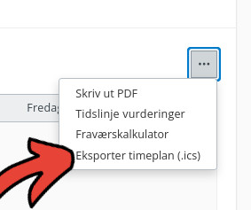

# 3. Kalendereksport

Kalendereksport lar deg laste ned timeplanen din fra VIS InSchool som en kalenderfil.

Filen kan importeres i kalenderapper som Google Calendar, Apple Calendar og Outlook.

## Dette kan du gjøre

- Få timeplanen inn i kalenderappen din.
- Se skoletimer sammen med andre avtaler.
- Slippe å legge inn alle timene manuelt.

## Slik bruker du den

Gå til startsiden eller timeplanen i VIS InSchool.

Klikk på menyknappen med tre prikker oppe til høyre i timeplanen:

Velg **Eksporter timeplan (.ics)** i menyen:

Nettleseren laster ned en fil som heter `timetable.ics`. Filen havner vanligvis
i Nedlastinger-mappen, men plasseringen kan avhenge av nettleserinnstillingene
dine.

Importer filen i kalenderappen du bruker:

| Kalenderapp | Hvordan importere `.ics`
|---|---|
| Google Calendar | På desktop: gå til **Settings → Import & export → Import**, velg `.ics`-filen fra PC-en, velg kalender, og trykk **Import**.
| Apple Calendar / iCloud Calendar | På Mac: åpne Calendar-appen, bruk **File → Import**, eller dra `.ics`-filen inn i Calendar. Velg kalenderen hendelsene skal legges i.
| Microsoft Outlook for Windows | Gå til **File → Open & Export → Import/Export**, velg **Import an iCalendar (.ics) or vCalendar file (.vcs)**, velg filen, og åpne/importer.
| Outlook.com / Outlook on the web | Bruk **Add calendar / Legg til kalender** og importer fra `.ics`-fil.

## Eksempel på bruk

Hvis du vil se skoletimene sammen med fritidsaktiviteter og avtaler, kan du
eksportere timeplanen fra VIS og importere `timetable.ics` i kalenderappen din.
Da vises skoletimene som vanlige kalenderhendelser.

## Hva er en .ics-fil?

En `.ics`-fil er en kalenderfil. Den inneholder tidspunkt, datoer og tekst for kalenderhendelser.

Det betyr at kalenderapper kan lese filen og legge skoletimene inn i kalenderen din.

## Hvis det ikke fungerer

Sjekk at userscriptet er aktivert, at du er logget inn i VIS InSchool, og at
nettleseren ikke blokkerer nedlastingen. Hvis kalenderappen ikke importerer
filen, prøv å laste ned filen på nytt og kontroller at kalenderappen støtter
import av `.ics`-filer.

Se også [hjelp og feilsøking](../hjelp.md).

## Begrensninger

- Eksporten lager en fil på eksporttidspunktet.
- Den synkroniserer ikke automatisk senere endringer i timeplanen.
- Importopplevelsen varierer mellom kalenderapper.
- Modulen bruker data fra VIS InSchool og kan slutte å fungere hvis VIS endrer systemet sitt.

**Neste:** [Få hjelp hvis noe ikke fungerer](../hjelp.md)
